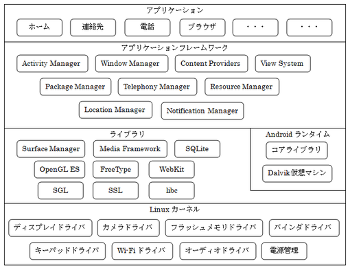

# ___ (課題)AndroidStudio ワークスペースGitHub管理方法について考える ___  
(少し古め) <https://qiita.com/hisurga/items/28a707c6d53caf0423f2>
##### <http://gihyo.jp/dev/serial/01/android_studio/0024>
---
# Android  

最終編集日時:2018/12/13

## Androidとは  
Googleが開発、公開している携帯端末やタブレットPCのOS。  
Linuxをベースに開発され、アプリケーションを実行するために **Dalvik VM** 等のソフトウェアが搭載されている。  

___  

Dalvik VM?  
ダルビック仮想マシン  
Android 5.0より **Android Runtime** に置き換えられた。  

* 簡単に...  
Androidアプリを端末で実行する際は、アプリのコードを実行可能にする必要がある(コンパイル)。  
このプロセスを担うもの。  

___  

### Androidを構成する要素  
* Linuxカーネル
* アプリケーションフレームワーク
* アプリケーション
* ライブラリー

### Androidの中身
Androidの構成は下図の通り  

この構造を **Androidアーキテクチャー** と呼ぶ。  

これはハードウェアが最下部に位置し、  
ソフトウェアを用途別にグループ分けを行い、  
ハードウェアに近い処理を行うグループから順に積み重ねる図。  
画像では見切れているが、Linuxカーネルの更に下層がハードウェア。  

デバイスドライバ群(Linuxカーネル部分)とアプリケーションフレームワークの橋渡しを行っているのが  
ミドルウェア群(ライブラリやAndroidランタイム)。  

* 処理の流れ  
ユーザーがアプリを操作  
↓  
ミドルウェア群ソフトウェア順次呼び出し  
↓  
Linuxカーネルのデバイスドライバーに処理命令  
↓  
ハードウェアが応答  

各グループを簡単に...  

#### アプリケーション  
* Androidアーキテクチャーの最上部に位置  
* ユーザーからの操作を直接受ける箇所(ホーム[待ち受け画面]、webブラウザー、等のAndroidアプリケーション)  
* Androidアプリケーションは基本的にJavaで記述  
* AndroidアプリケーションはJavaソースコード以外にXML形式ファイル(操作画面の設定情報やアプリで使用する文字の情報を収めたもの)、
リソースファイル(アイコンや画像などを表示するファイル)で成り立つ  
* 上記はAndroid開発ツールでビルド(実行可能なファイルに)する時に1つのパッケージとしてまとめられる  
* 開発したアプリを配布(公開)する時は開発ツールを使用し **apk** 形式のファイルにまとめられる  

#### アプリケーションフレームワーク  
* アプリケーション層の下に位置  
* AndroidのAPI群  
* API(Application Programming Interface)はOSの機能を利用する為の「窓口」として機能する  

	アプリケーションフレームワークのコンポーネント構成
	* アクティビティマネージャー(Activity Manager)  
	アプリの起動、中断、終了などのライフサイクルを提供、管理を行う  

	* ビューシステム(View System)  
	UI(ユーザーインターフェース)を構成する部品を提供、イベントの発生管理を行う  

	* ウィンドウマネージャー(Window Manager)  
	スクリーンの領域をウィンドウに分けて管理し、描画用のサーフェス(フレーム用のバッファ)を割り当てる  
	ウィンドウ関連の処理を行うコンポーネント  

	* コンテントプロバイダー(Content Provider)  
	アプリ間で共有可能なデータをカプセル化したコンポーネント  

	* ロケーションマネージャー(Location Manager)  
	Android端末が位置情報を認識できるようにするコンポーネント  

	* ノーティフィケーションマネージャー(Notification Manager)  
	ユーザーの操作に割り込むことなく、メッセージの着信などの重要なイベントを通知するためのコンポーネント  

	* パッケージマネージャー(Package Manager)  
	端末にインストールされている他のアプリのパッケージに関する情報を取得する為のコンポーネント  

	* リソースマネージャー(Resource Manager)  
	アプリから文字や画像などのリソースにアクセスできるようにするコンポーネント  

	* テレフォニーマネージャー(Telephony Manager)  
	端末のテレフォニー(電話)サービスに関する着信や発信などの情報をアプリ側で取得できるようにするコンポーネント  

#### ライブラリ  
* APIとLinuxカーネルのドライバー群との橋渡しを行うソフトウェアが含まれる。  
CやC++で記述されていて、機械語(ネイティブコード)にコンパイルされた状態で各グループごとにライブラリとして納められえる。  

	ハードウェアに近い低いレベルの処理例(低水準言語?)  
	* Free Type  
	ビットマップ形式とベクター形式によるフォントのレンダリング(描画)をサポート  

	* libc  
	C言語の標準システムライブラリ  
	Linuxベースの携帯端末用にチューニングされている。  

	* LibWebCore  
	AndroidブラウザーとUI部品のWebViewを駆動するための高速なWebブラウザーを提供する為のライブラリ  
	「WebKit」と呼ばれるライブラリをベースとし、GoogleChromeやAppleのSafariにも使われている。  

	* Media Framework  
	PacketVideo社のOpenCOREをベースとする音声・動画の録音(録画)、再生、静止画の撮影を行うためのライブラリ  
		* サポートフォーマット  
			* MPEG-4  
			* H.264  
			* MP3  
			* AAC  
			* AMR  
			* JPEG  
			* PNG  
			* GIF  
			etc...

	* OpenGL ES(Embedded System)  
	OpenGL ES 1.0/1.1/2.0のAPI群をベースとするOpenGLを実装するための3Dグラフィックス用ライブラリ  
	ハードウェア側に3Dアクセラレーション(描画を支援する機能)が利用出来ない時のために、独自の3Dソフトウェアスタライザーが用意されている。  
		* OpenGL  
		Open Graphics Library、2D・3DCGライブラリ
	* SGL  
	標準的(?)な2Dグラフィックスエンジンを提供するライブラリ  

	* SQLite  
	すべてのアプリから利用可能な、軽量かつ高性能なリレーショナルデータベースエンジンを提供するライブラリ  
	iPhoneでも使用されている  

	* SSL  
	SSL(Secure Sockets Layer)をベースとしたセキュアな通信を提供するためのライブラリ  

	* Surface Manager  
	ディスプレイへのアクセスを管理するライブラリ  

	* Androidランタイム  
	Java 1.5 SEと互換性を持つライブラリ  
	アプリケーション開発者は、Java言語での開発と同じ感覚でコア・ライブラリを扱える  
	「Dalvik(ダルビック)仮想マシン」、「コア・ライブラリ」で構成される  
		* Dalvik仮想マシン  
		* コア・ライブラリ  

#### Linuxカーネル  
* スクリーンへの表示やタッチスクリーンからの入力、フラッシュメモリ、カメラ、オーディオ、Wi-Fi機器等  
ハードウェアと直接やり取りを行う部分(デバイスドライバー)  
* ハードウェア用のドライバーに加え、プロセス間通信や電源管理用のドライバが含まれる。  
* OSの基盤  
* デスクトップ用OSのLinuxをベースとし、モバイル用に新たに開発されたOS  

___  

## プロジェクトの作成  
プロジェクトの作成時に指定する項目はEclipseと同様 
* Application Name  
作成するAndroidアプリの名前を入力  
デフォルトでは「My Application」と入力されている  

* Company Domain  
Package nameの一部に使用される  
作成したアプリケーションを公開する場合、取得済みのインターネットドメインを入力する  
作成したアプリケーションを公開しない場合、架空のドメイン名を入力しておく  

* Package name  
パッケージとは、開発するアプリに必要なプログラムの部分をまとめたもの  
Javaのアプリケーションでは、実行する機能別にソースコードをまとめて「クラス」単位で管理する  
1つのアプリケーションは、いくつかのクラスを組み合わせた構造になっている  
クラスをひとまとめにして管理できるようにしたのがパッケージ  
パッケージには名前が必須  
もちろんクラスにもそれぞれ名前があり、クラス内部のコードから別のクラスの機能を呼び出すときにクラス名を指定する  
世界中には沢山のJavaプログラムが存在しているので、同じ名前のクラスが他にも存在する可能性は十分にある  
混乱を防ぐために世界に2つとないパッケージ名を付けることで他と区別する  
例えば「MyClass」クラスに自動入力されたパッケージ名を使えば、「com.example.myapplication」パッケージの  
「MyClass」クラスとなるので、他に同じ名前のクラスが存在してもこれらとは区別される  
自動入力されたパッケージ名には逆ドメイン記法が使われている  
これは、取得済みのドメイン名を逆から書いたもの  
ドメイン名は世界に1つしかないという理由から、Javaのパッケージ名の付け方にはこの方法が使われる  
「example.com」ドメインはテスト用途で使用できる特殊なドメインでだれでも使用できる  
ただし、架空のドメイン  

* Project location  
プロジェクトを保存する場所を指定  

### アプリケーションが動作するAndroidのバージョン選択  
* Phone and Tablet  
スマートフォン、タブレット用のアプリを開発  
当面はこちらを選択  

* Minimum required SDK  
作成するアプリが動作するSDKの最小バージョンを指定  
アプリケーションとしての下位互換  
選択するタイミング...?  

### 画面の見た目  
* Add No Activity  
アクティビティ(画面)を作成しない  

* Blank Activity  
アクションバーを備えたアクティビティを作成  
1つの画面を2つに分割する機能(フラグメント)を備えたアクティビティを作成することも可能  

* Blank Activity with Fragment  
フラグメントを作成する空のアクティビティを作成  

* Fullscreen Activity  
端末の画面全体、いわゆるフルスクリーンで動作するアプリ用のアクティビティ  
メインの画面で項目を選択すると、内容がフルスクリーンで表示されるアプリを作成する場合に指定  

* Google Admob Ads Activity  
バナー広告を配置できるアクティビティを作成する  

* Google Maps Activity  
Google社のGoogle Mapsサービスを利用して地図を表示するアプリを作成する場合に指定  
Mapビューと呼ばれる地図を表示する為の画面が追加される  

* Login Activity  
テキストを入力するためのエリアとボタンを備えた、ログイン画面として利用できるアクティビティ  

* Master/Detall Flow  
2つのアクティビティを作成する  
この項目を選択すると、1つのアクティビティにリスト(マスター)を表示し、  
リストから選択された項目に従ってもう1つのアクティビティの表示を切り替える  
2つのアクティビティは画面上に同時に表示されるので、選択したタブによって表示を切り替えるような画面にしたい場合使用  

* Navigation Drawer Activity  
画面の左側からスワイプして出てくるオプションメニューを表示するパネルを備えたアクティビティを作成  

* Scrolling Activity  
画面がスクロール可能なアクティビティを作成  

* Settings Activity  
チェックボックスとテキストのセットをリスト形式で表示するアクティビティを作成  
設定用の画面を用意したいときに使用  

* Tabbed Activity  
タブで画面を切り替える機能を備えたアクティビティを作成  

↓開発準備↓
Android 6.0 を実行するAVD...  

* Android Studioの日本語化  
<https://fidscreate.com/tool/android-studio#japanese3>  
条件： **Android Studio3.0 以上**  
Pleiadesプラグインを使用  
Pleiadesプラグインの解凍はWindowsエクスプローラー、7-Zip、WinRARにて正常に解凍、動作することが確認されている為解凍の際注意  
正常に解凍が完了すると「setup.exe」へのショートカットがあるので選択  
**Pleiades日本語化プラグインのセットアップ** が立ち上がる  
日本語化するアプリケーションにAndroid Studio実行ファイル(studioXX.exe)を選択し、日本語化するボタンを押下  

